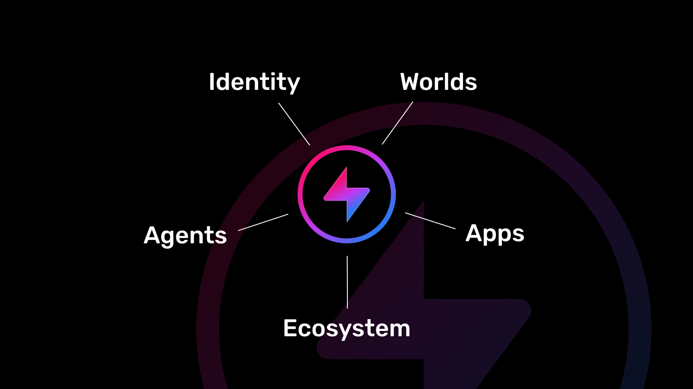

# Hyperfy ⚡️

## Overview

<div align="center">
  
</div>

## 🧬 Features

- Standalone persistent world
- Host them on your own domain
- Connect via Hyperfy for portable avatars
- Realtime content creation in-world
- Realtime coding in-world (for devs)
- Fully interactive and interoperable app format
- Highly extensible

## 🦹‍♀️ Use Cases

- Live events
- Storefronts
- Podcasts
- Gaming
- Social

## 🚀 Quick Start

### Prerequisites

- Node 22.11.0+ (eg via nvm)

### Install

```bash
git clone https://github.com/hyperfy-xyz/hyperfy.git my-world
cd my-world
cp .env.example .env
npm install
npm run dev
```

### 🌱 Alpha

This project is still in alpha as we transition all of our [reference platform](https://github.com/hyperfy-xyz/hyperfy-ref) code into fully self hostable worlds.
Most features are already here in this repo but still need to be connected up to work with self hosting in mind.
Note that APIs are highly likely to change during this time.


